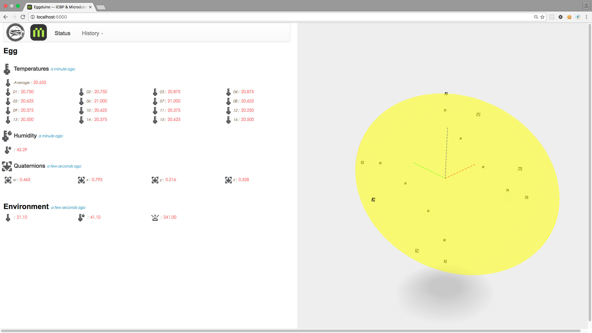
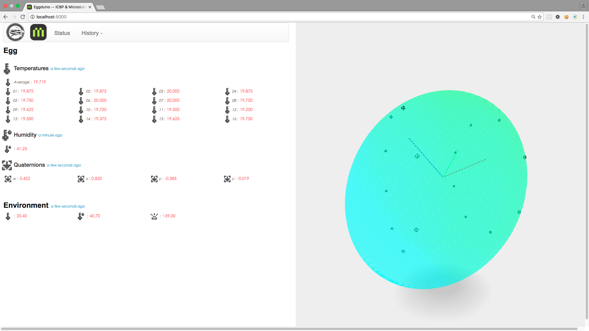

# mAcron for Eggduino
 
This software is a part of Eggduino, a project of [ICBP (International Centre for Birds of Prey)](http://www.icbp.org/index/), supported by microduino.

## License 

Author : Hao CHEN
Email : iascchen (at) gmail.com

You can modify and distribute these code freely for education and scientific research, under the license of [Apache License 2.0](LICENSE) 

## Software Architecture

                       |
                      BLE
         Smart Egg ----|--->  mAcron Daemon --------> SQLite --------> mAcron Web App
                       |     (Recieve datas)                           (Visualization)
                       |
    Eggduino Hardware  |                 Eggduino Station 
                       |

## Connect to mAcron

mAcron is running on Intel Edison.

OS : Poky (Yocto Project Reference Distro) 1.7.3

### Connect with USB

You can use Putty(Win) or Term2(Mac) 

#### on Windows

TBD

#### on Mac OSX

You can use some tools such as Terminal or iTerm2. 

    $ ls /dev/tty.usbserial*
    /dev/tty.usbserial-A402EXKV
    
    
    $ screen /dev/tty.usbserial-A402EXKV 115200
    (Sometimes, you need press the enter key two times)
    
    eggduino login: root
    Password: eggduino
    Last login: Sun Oct  9 05:17:00 UTC 2016 on ttyMFD2
    root@eggduino:~# 

### Connect with SSH

If want to use ssh to access eggduino, you must setting the wireless connection firstly.

* Connect eggduino with USB ( just one time )
* Setting wireless ( just one time )
* Connect with SSH and wireless

#### Setting Wireless Connection

The network structure show as follow:

                        BLE                       Wifi                     Wifi
    Eggduino Hardware  ----->  Eggduino Station  ----->  Wireless Router  <-----  Your computer

Here recorded the steps of wifi configuration, you can change the setting according to your wireless network. use `configure_edison --wifi`
    
    root@eggduino:~# configure_edison --wifi
    Configure Edison: WiFi Connection

    Scanning: 1 seconds left

    0 :     Rescan for networks
    1 :     Exit WiFi Setup
    2 :     Manually input a hidden SSID
    3 :     ...
    4 :     ...
    5 :     Microduino_IoT

    Enter 0 to rescan for networks.
    Enter 1 to exit.
    Enter 2 to input a hidden network SSID.
    Enter a number between 3 to 12 to choose one of the listed network SSIDs: 5
    Is Microduino_IoT correct? [Y or N]: Y
    Password must be between 8 and 63 characters.
    What is the network password?: ***************
    Initiating connection to Microduino_IoT. Please wait...
    Attempting to enable network access, please check 'wpa_cli status' after a minute to confirm.
    Done. Please connect your laptop or PC to the same network as this device and go to http://192.168.199.226 or http://eggduino.local in your browser.

You can use `wpa_cli status` the check the wireless setting, and got the ip address of eggduino station.

    root@eggduino:~# wpa_cli status
    Selected interface 'wlan0'
    bssid=d0:ee:07:42:b0:52
    ssid=Microduino_IoT
    id=2
    mode=station
    pairwise_cipher=CCMP
    group_cipher=CCMP
    key_mgmt=WPA2-PSK
    wpa_state=COMPLETED
    ip_address=192.168.199.226
    p2p_device_address=fe:c2:de:3c:a6:c8
    address=fc:c2:de:3c:a6:c8

If you want to confirm the wireless setting, you can check this file `/etc/wpa_supplicant/wpa_supplicant.conf` 

    vi /etc/wpa_supplicant/wpa_supplicant.conf

#### Connect with SSH from your Computer

    $ ssh root@192.168.199.226
    root@192.168.199.226's password:
    Last login: Sun Oct  9 05:17:22 2016

#### Set Edison as AP (Not Fully Tested)

If let Edison work as AP, the network structure will be as :

                        BLE                       Wifi
    Eggduino Hardware  ----->  Eggduino Station  <-----  Your computer
    
**BUT** I found it is **VERY SLOW**. so I don't use this mode. [Read more details](http://rwx.io/blog/2015/08/16/edison-wifi-config/)

## Run mAcron for Eggduino

The source code and data are stored on SD Card. 

    root@eggduino:~# cd /media/sdcard/mAcron-egg
    root@eggduino:/media/sdcard/mAcron-egg# ls
    README.md  config.py   db      manage.py          tests
    app        daemon  requirenments.txt  start_server.sh
    
### Directory Structure

    |- app          ----->   Source code of web server
    |- db           ----->   database.db stored the all data, it is a SQLite file  
    |- daemon       ----->   The daemon to recieve data from eggduino and store them to SQLite
    |- docs         ----->   Markdown file and imgs used on README
    |- tests        ----->   Some test code
    config.py       ----->   config the SQLite Database stored on 'db/database.db'
    start_server.sh ----->   Script to run web server on BACKEND
    README.md       ----->   Please read this file firstly

If you want to get the whole data, you should copy the file under folder 'db', and process it as SQLite DB file.
There are some tools can open SQLite DB file, such as 'DB browser of SQLite' of MAC.
    
### Web Server

#### Run Server

You can start the server by `python manage.py runserver`, you can access the server with http://ip_address:5000

    root@eggduino:/media/sdcard/mAcron-egg# python manage.py runserver
    /usr/lib/python2.7/site-packages/flask/exthook.py:71: ExtDeprecationWarning: Importing flask.ext.script is deprecated, use flask_script instead.
      .format(x=modname), ExtDeprecationWarning
     * Running on http://0.0.0.0:5000/ (Press CTRL+C to quit)
     * Restarting with stat
    /usr/lib/python2.7/site-packages/flask/exthook.py:71: ExtDeprecationWarning: Importing flask.ext.script is deprecated, use flask_script instead.
      .format(x=modname), ExtDeprecationWarning
     * Debugger is active!
     * Debugger pin code: 277-916-687

Disable Debug mode, change the `use_debugger=True` to `use_debugger=False`

    root@eggduino:/media/sdcard/mAcron-egg# vi manage.py
    
    ...
    manager.add_command("runserver", Server(host='0.0.0.0', port=5000, use_debugger=False))
    ...

Run Web Server as backend. You can use the shell `./start_server.sh`

    root@eggduino:/media/sdcard/mAcron-egg# nohup python manage.py runserver &
    
    root@eggduino:/media/sdcard/mAcron-egg# tail -f nohup.out
    
Stop backend running Server

    root@eggduino:/media/sdcard/mAcron-egg# ps -ef | grep python
      501 67739     1   0  2:40PM ttys002    0:00.22 python manage.py runserver
      501 67780 63076   0  2:42PM ttys002    0:00.00 grep python
    root@eggduino:/media/sdcard/mAcron-egg# kill -9 67739

    
#### Screen Snapshots

`/Status` show the latest data send from egg and station.

`/History/Temperatures` show the temperatures of egg in latest one hour.

`/History/Quaternions` show the quaternions of egg in latest one hour.

`/History/Humidity` show the humidity of egg in latest one hour.

`/History/Environment` show the data of station in latest one hour.

### Run Daemon 

#### As frontend process

When you just want to test the system, you can start daemon in console, and receive data form eggduino. 
In this mode you can interact with it by input interval command. More detail of please read the part of "Change interval when mAcron running as frontend process". 

**But if you close the windows of terminal console, the daemon will be exited too**.

    root@eggduino:/media/sdcard/mAcron-egg# cd daemon/
    root@eggduino:/media/sdcard/mAcron-egg/daemon# ./macron.py -c ab0100,ab0200,ad0300,ab010114,ab020105,ab030102
    
#### As backend process

When you need to let the station collect data continuously, even after you close the terminal console. More detail of command, please read the part of "-c/--cmds The Commands"

You should:

1. Start the daemon as backend. The example show : stop all data push with `ab0100,ab0200,ad0300,ad0400,`, and start data intervals as : temperature 20s(Hex 14), humidity 5s(Hex 05), quaternions 2s(Hex 02), station 20s(Hex 14)
    
        root@eggduino:/media/sdcard/mAcron-egg/daemon# nohup ./macron.py -c ab0100,ab0200,ad0300,ad0400,ab010114,ab020105,ab030102,ab040114 &

2. Check the output information is correct, can use `tail` command as follow, and use `Ctrl+C` exit tail display

        root@eggduino:/media/sdcard/mAcron-egg/daemon# tail -f nohup.out 
    
3. Disconnect the console terminal and leave. 

In this mode, if you want change data interval, you **MUST** kill old process and restart new backend daemon with new interval value.

You should:
    
1. Check the process id of mAcron daemon

        root@eggduino:/media/sdcard/mAcron-egg/daemon# ps -ef | grep macron
    
2. `kill` old process as follow. The XXXX is process id of the daemon. (If you don't understand what i am talking ,you can ask somebody known linux, or goolge ps and kill command of linux)

        root@eggduino:/media/sdcard/mAcron-egg/daemon# kill -9 XXXX
        
3. Restart daemon. The example start intervals as : temperature 40s(Hex 28), humidity 20s(Hex 14), quaternions 10ms(Hex 0a), station 40s(Hex 28)
    
        root@eggduino:/media/sdcard/mAcron-egg/daemon# nohup ./macron.py -c ab0100,ab0200,ad0300,ad0400,ab010128,ab020114,ab0301000a,ab040128 &

#### -c/--cmds The Commands 

**IMPORTANT** If you want to change the data interval, you should send stop before start. for example: 

    ab0100 (press enter) 
    ab010101 (press enter) 

Stop notification

* ab0100 / AB0100 : Stop temperature notification of eggduino
* ab0200 / AB0200 : Stop humidity notification of eggduino
* ab0300 / AB0300 : Stop quaternions notification of eggduino
* ab0400 / AB0400 : Stop station notification

Start notification with default interval

* ab0101 / AB0101 : Start temperature notification with default interval, 20s. its minimal value is 20s
* ab0201 / AB0201 : Start humidity notification with default interval, 70s. its minimal value is 5s
* ab0301 / AB0301 : Start quaternions notification with default interval, 2s. its minimal value is 2s
* ab0401 / AB0401 : Start station notification with default interval, 5s. its minimal value is 2s

Start notification with setting interval

* ab0101nn / AB0101nn : Start temperature notification with setting interval, for example : set interval 20s should send ab010114. According the LM75 sensor is slow, only return 1 temperature per second, so if you send `ab010101`, the temperature return interval will be about 16s
* ab0201nn / AB0201nn : Start humidity notification with setting interval, for example : set interval 5s should send ab020105
* ab0301nnnn / AB0301nnnn : Start quaternions notification with setting interval, the unit is **micro seconds**, for example : set interval 2ms should send ab03010002. 
* ab0401nn / AB0401nn : Start station notification with setting interval, for example : set interval 15s should send ab04010f

**nn** is the hex value of seconds. for example : if you want to set interval as `10` seconds, the **nn** should be `0a`
**nnnn** is the hex value of **micro seconds**. for example : if you want to set interval as `10` micro seconds, the **nnnn** should be `000a`

    // AB03010001 -- start, interval is 1ms;
    // AB03010064 -- start, interval is 100ms;
    // AB0301012C -- start, interval is 300ms;
    // AB03010384 -- start, interval is 900ms;
    // AB03010BB8 -- start, interval is 3000ms;
    // AB03011388 -- start, interval is 5000ms;
    // AB03012710 -- start, interval is 10000ms;

#### Change interval when mAcron running as frontend process

When mAcron is running, you can input interval command

    ...
    AABBAA1E04924032004E2BDF2BB40A750D0D0A
     -> 1477279723265 [0.677, 0.685, 0.167, 0.21]
    > ab0100AABBAAFA03524092004C2B212C060A270D0D0A
     -> 1477279725968 [0.677, 0.69, 0.157, 0.206]
    
    ab0100

	    ==> command sending : AB0100
     
    > Ma;20.9;41.6;165.0
     -> 1477279728155 (20.9, 41.6, 165.0)
    AABBAAEA037A404800352B2C2CF7095A0D0D0A
     -> 1477279728283 [0.675, 0.69, 0.156, 0.209]

## Adjust Temperature Visualization

The rainbow color palette will map temperatures to 512 colors, you can change `lut = getLut(19.0, 21.0)` to gain better effect:

    function init() {
        // !!!!!!!!!!!!
        // You can change this range for color lut
        lut = getLut(19.0, 21.0);   // getLut( min_temperature, max_temperature);
        ...

You can find these code in: 
* /app/templates/egg_tems.html(**line 79**) 
* /app/templates/curr_status.html(**line 131**) 